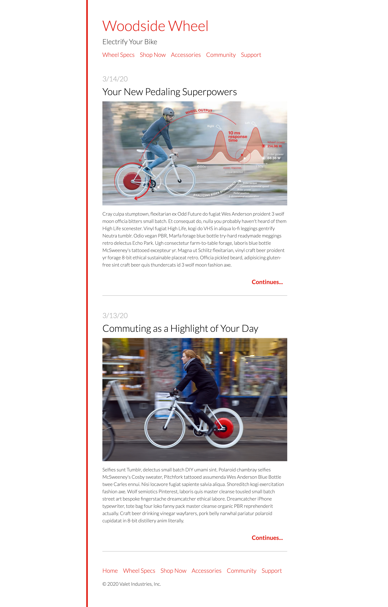
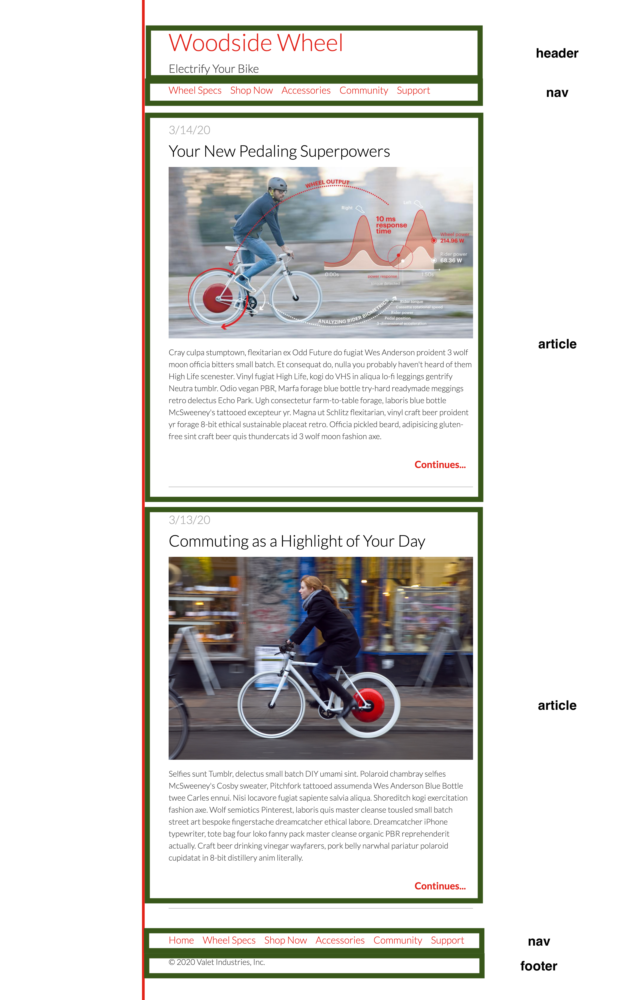

# HTML / CSS Lab

In this lab you will practice converting a design into HTML and CSS

The design is below.

Convert the design into HTML in the `index.html` file, and then write the CSS in `main.css`.

We'll provide some style information below. **You can approximate spacing.**

Content for the page can be found in copy.txt.

Links do not need to point anywhere.

#### Steps to complete

1. HTML skeleton (empty html elements)
2. Put content inside of HTML tags (can copy from copy.txt) (use image filenames as src="" value)
3. Style your page with CSS at bottom of main.css (Instructions below)

#### References:

CSS Property Almanac: https://css-tricks.com/almanac/

The Box Model: https://css-tricks.com/the-css-box-model/

HTML Elements Reference: https://developer.mozilla.org/en-US/docs/Web/HTML/Element

#### Provided style information

##### I have already set these styles on 'body' to get the page started:

- High-level text properties
- "Lato" font
- 1.5 line-height
- max-width 720px
- 54px of padding
- solid border on the left 6px wide with a color of #e2231a

##### YOU DO:

Links (and other red colored text)
color #e2231a

Headings:
font-weight: 100

Date:
color #cccccc

Article Title
color black

HINT: You can make the images fit nicely inside their parent elements by setting `width: 100%`.

HINT 2: To right align "continues" it may be easiest for now to make that element either a heading (like h6) or a link inside a heading and set `text-align: right` on the heading.

HINT 3: For adjusting the vertical space between elements, you can use `margin-top` and `margin-bottom`. For example `margin-bottom: 10px` to put space beneath an element. You should use the browser inspector (right click > inspect element) to determine which elements' margins are causing current spacing and adjust accordingly.

Bonus (DO AFTER ALL ELSE COMPLETE): look up how to do element hover styles

Links hover color: #aa0000

### Design

### Structure

